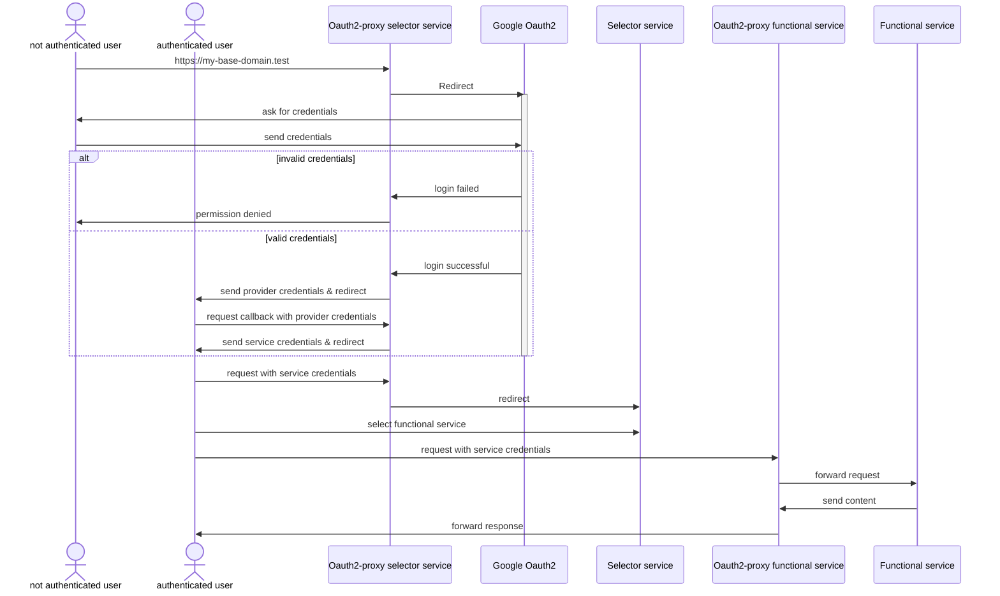

# Proof of concept for Oauth2 proxies with a single authentication

This is a proof of concept for having multiple separated services, which each one is protected by a
different Oauth2-proxy instance using the same Oauth2 configuration.

## Requirements

You need to have installed in the machine that will run it.
- [Docker compose](https://docs.docker.com/compose/)
- [Go](https://go.dev/). Used v1.20, but is should work with a previous one.
- A machine with a public IP and with the port 80 and 443 accessible from the internet, and
  administrative access rights (e.g. sudo). We needs those ports because it retrieves certificates
  for the domains from Let's Encrypt.

You need to have access to:
- A Google Cloud account with right to create [Oauth2 credentials for applications](https://support.google.com/cloud/answer/6158849?hl=en).
- A domain name with access to its DNS management to create A registers. You can use a sub-domain.

NOTE this proof of concept uses [Google Cloud Oauth2](https://support.google.com/cloud/answer/6158849?hl=en)
provider, you should be able any of the providers accepted by
[Oauth2-proxy](https://oauth2-proxy.github.io/oauth2-proxy/docs/configuration/oauth_provider),
however, you will have to change the _docker-compose.yml_ file.

## How to set it up

1. Create the A registers for the base (sub-)domain that you are going to use setting the public IP
   of the machine that will run this.
   Create one A register for the base (sub-)domain.
   Create one A register for the following sub-domain of the base (sub-)domain: `functional`. For
   example `functional.my-base-domain.test`, etc.
1. Create a Google Oauth2 credentials for applications. You can follow the [Oauth2-proxy
   documentation](https://oauth2-proxy.github.io/oauth2-proxy/docs/configuration/oauth_provider#google-auth-provider).

   You have to add the 2 domains to the _Authorized Javascript origins_ (e.g.
   `https:://my-base-domain.test`, `https://functional.my-base-domain.test`).

   You also have to add 2 domains to the _Authorized redirect URIs_ with the path
   `/oauth2/callback` (e.g. `https://my-base-domain.test/oauth2/callback`,
   `https://functional.my-base-domain.test/oauth2/callback`).
1. Take note of the _client ID_ and _client secret_ of the Google Oauth2 credentials.
1. Fill the values of environment variables in the `env` file. `IFRAIXEDES_EMAIL_DOMAIN` environment
   variable sets the e-mail domain that you're service authorize, if you want any, use `*`.

## How to run it

In one terminal session run with administrative rights (e.g. sudo) from the same folder where you
have cloned this sources `docker compose --env-file env up`.

In another terminal run `IFRAIXEDES_BASE_DOMAIN=my-base-domain.test go run .`.

At this point you can navigate to the service that shows the list of services to access which is
`https://my-base-domain.test`. Oauth2-proxy will present you the login screen and if it successfully
you'll be redirected to the "selector" service.

Click for accessing the "functional" service. You cand access without having to log in again if you
navigate to its specific URL `https://functional.my-base-domain.test`.

If you want to see if you can access to one of the services without having a valid authentication
session, logout navigating to `https://my-base-domain.test/oauth2/sign_out` and try to access to the
functional service `https://functional.my-base-domain.test`. You'll see that the Oauth2-proxy will
present you the login screen; if you login successfully you'll be able to access to the other
services without having to login again as before.

## For what do I needed this?

I wanted to have a bunch of services:
- Only accessible after an Oauth2 login.
- Running in different regions.
- Each service with it's Oauth2-proxy, for not having a single one and having to peer networks and
  no single point of failure for the authentication service.
- All of them accessible with the same Oauth2 credentials.
- Users must not have to login again once they have a successful service in one of them, although I
  wanted mostly to access through the "selector" service.

Let's show that in a diagram

In this proof of concept the "selector" service sends a cookie to the client so the client is
automatic redirected to the "functional" service once the accessed to the "functional" service
through it. The concept was to emulate a "selector" service with several "functional" services and
when one is chosen, the user is always redirected to that one unless that they explicitly want to
select another one. This cookie isn't a requirement.

NOTE that this proof of concept only specifies one "functional" service for simplicity, but you can
crate as many "functional" services with their own Oauth2-proxy as you need.

## Relevant findings

When I was doing this proof of concept, I realized:
- Oauth2-proxy `--cookie-samesite` cannot be set to `strict` because, otherwise, Google Oauth2
  doesn't work.
- Oauth2-proxy `--cookie-name` can be used to use the `__Secure-` prefix (e.g.
  `--cookie-name=__Secure-Oauth2`), but not with the `__Host-` prefix because we need to set the
  domain to the cookie to make the single login to work. See
  [cookie prefixes](https://developer.mozilla.org/en-US/docs/Web/HTTP/Cookies#cookie_prefixes).
- All your services ("selector" and "functional") must be hosted under the same base (sub-)domain.
  This is needed because otherwise the authentication cookies won't be send across the different
  services because of the browser security restrictions.
